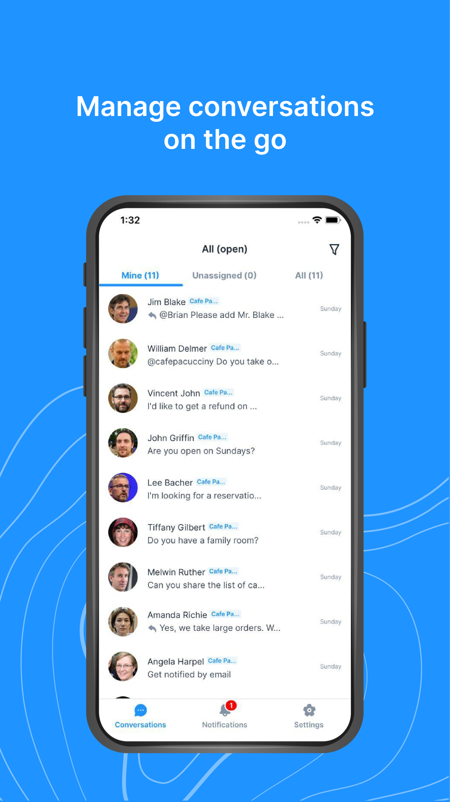
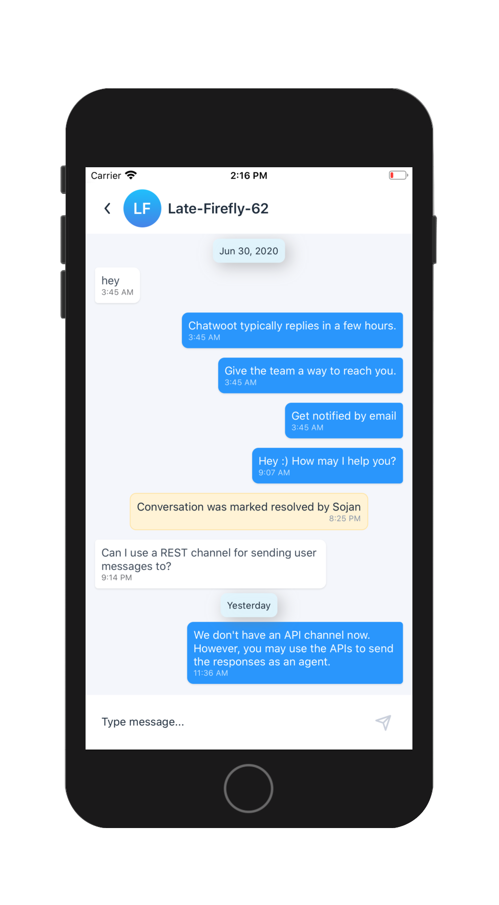
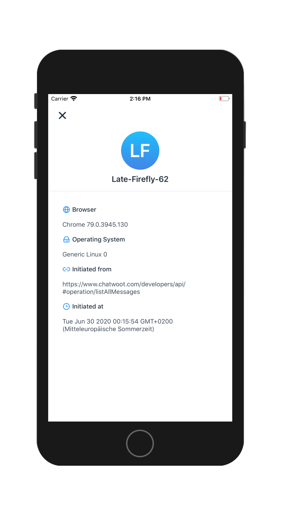
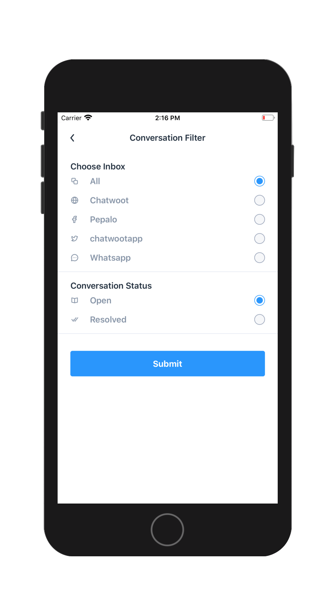
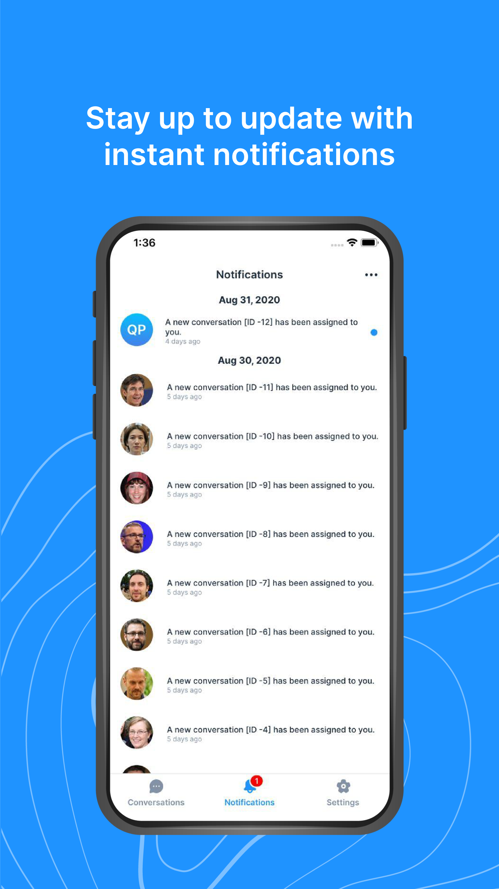
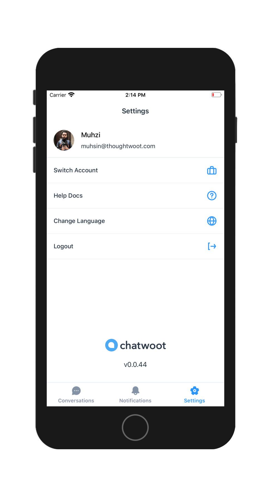

  

  
Mobile app for chatwoot platform. Built with React Native

  
Chatwoot is an opensource alternative to Intercom, Zendesk, Drift, Crisp etc.

---

   
   
  
  
   
 

## Features

- Do not miss out on the new customers
- Follow up on customer conversations on go
- Reply easily with canned responses
- Receive realtime notifications about system activities
- Communicate with other team members via private notes
- Assign statuses to your conversations
  ... and more to come!

  
  
  
  
  
  

## Download Android/iOS application

To help with testing Chatwoot updates before they're released, you can install the Android/iOS beta version.

  

  

## Feedback & Contributing

Feel free to send us feedback on [Twitter](https://twitter.com/chatwootapp) or [file an issue](https://github.com/chatwoot/chatwoot-mobile-app/issues).

If you wish to contribute, please take a quick look at the [CONTRIBUTING.md](CONTRIBUTING.md) guide.

If you want to self deploy the Chatwoot mobile app, please take a look at the [CUSTOM_RELEASE_GUIDE.md](CUSTOM_RELEASE_GUIDE.md) guide.

If there's anything you'd like to chat about, please feel free to join our [Discord](https://discord.gg/cJXdrwS) chat!

_Chatwoot_ &copy; 2017-2020, ThoughtWoot Inc - Released under the MIT License.
